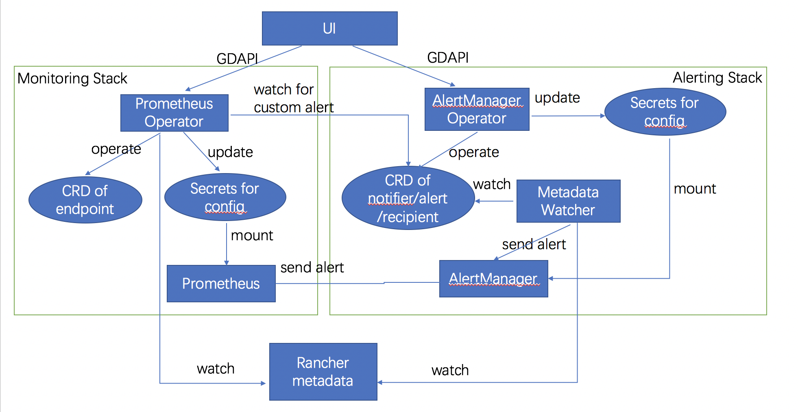
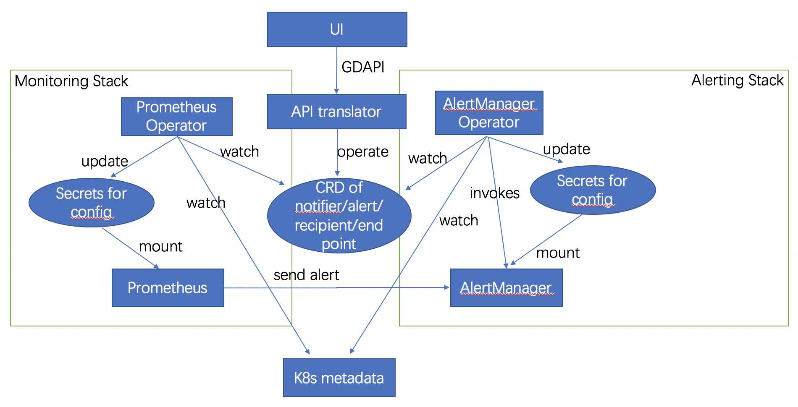

# Design Spec

This spec decribes what we are going to do and how we have done it on the current stage.

## Overview
For details about functionality, please refer to the [design doc](./Monitoring-Design.docx)

The monitoring contains two seperate stacks. One is for alerting with built-in monitoring, which is using AlertManager and will be on by default. The other is using Prometheus, which user can monitor their own endpoints and add custom alert rules. 

The alerting stack consists of 3 compoents: native AlertManager, AlertManager operator and metadata watcher. AlertManager operator which provides GDAPI for alert/notifier/recipient, stores data to k8s CRD and makes changes to configuration of alert manager. Metadata watcher watches alert rules in the CRD and watch rancher matadata to check if the any rules is valid, if so sends an alert to the AlertManager.  

The monitroing stack consists of 2 compoents: native Prometheus and Prometheus operator. The Prometheus operator will provides GDAPI for endpoint, stores data to k8s CRD. It will also watch alert CRD for custom alert rules, make change to configuration of Prometheus based on endpoint and custom alert rules.    

<br>

<br>

## Status
The first version of alert manager operator is completed. The intergration bewteen UI and operator is mostly done. User can use UI to configure notifier and add/view/edit alert, and the configuration of alert manager will be generated properly by the operator. If we invokes alert manager's API to send an alert, notification will be sent out (only slack is tested).

## Current Implementation

### CRD

#### Notifier
The notifier is about the configuration for notification server. Currnetly it is per namespace. Once a namespace is created, 3 object of different types will be created by operator. UI will just allow to get/list/upadte notifier. The label is added by the operator and it is used for filtering when calling k8s list method. Data of different namespace are stored in the "kube-system" namespace.

```yaml
apiVersion: apiextensions.k8s.io/v1beta1
kind: CustomResourceDefinition
metadata:
  name: notifiers.monitoring.rancher.io
spec:
  group: monitoring.rancher.io
  version: v1beta1
  scope: Namespaced
  names:
    plural: notifiers
    singular: notifier
    kind: Notifier
---
apiVersion: monitoring.rancher.io/v1beta1
kind: Notifier
metadata:
  name: notifier-email
  labels:
    environment: default
    type: email
spec:
  type: email
  emailConfig:
    # SMTP authentication information.
    smtpAuthIdentity: identity1
    smtpAuthSecret: <secret>
    smtpAuthPassword: <secret>
    smtpAuthUsername: viky
    # The sender address.
    smtpFrom: zion@rancher.coom
    # The SMTP host through which emails are sent.
    smtpSmartHost: '127.0.0.1'
    smtpRequiredTls: false
---
apiVersion: monitoring.rancher.io/v1beta1
kind: Notifier
metadata:
  name: notifier-slack
  labels:
    environment: default
    type: slack
spec:
  type: slack
  slackConfig:
  	# The Slack webhook URL.
    slackApiUrl: <secret>
---
apiVersion: monitoring.rancher.io/v1beta1
kind: Notifier
metadata:
  name: notifier-pagerduty
  labels:
    environment: default
    type: pagerduty
spec:
  pagerdutyConfig:
    # The URL to send API requests to
    pagerdutyUrl: zion.pagerduty.com

```

#### Recipient
The recipient is to whom the notification can be sent. It can be created and selected in the adding alert page. 

``` yaml
apiVersion: apiextensions.k8s.io/v1beta1
kind: CustomResourceDefinition
metadata:
  name: recipients.monitoring.rancher.io
spec:
  group: monitoring.rancher.io
  version: v1beta1
  scope: Namespaced
  names:
    plural: recipients
    singular: recipient
    kind: Recipient

---
apiVersion: monitoring.rancher.io/v1beta1
kind: Recipient
metadata:
  name: receiver123
  labels:
    environment: default
    type: email
spec:
  type: email
  emailRecipient:
    address: test@rancher.com
  slackRecipient:
    channel: #test
  pagerdutyRecipient:
    serviceKey: <secret>


```

#### Alert:
The Alert CRD contains the rule that trigger alert and recipient of the notification.


```yaml
apiVersion: apiextensions.k8s.io/v1beta1
kind: CustomResourceDefinition
metadata:
  name: alerts.monitoring.rancher.io
spec:
  group: monitoring.rancher.io
  version: v1beta1
  scope: Namespaced
  names:
    plural: alerts
    singular: alert
    kind: Alert
---

apiVersion: monitoring.rancher.io/v1beta1
kind: Alert
metadata:
  name: uuid
  labels:
    environment: default
spec:
  description: Alert for my service
  sendResolved: false
  severity: critical
  object: service
  objecID: 1s1
  #only one rule can be set per Alert, below shows all the cases
  hostRule:
    PercentageOfDisconnected: 30
  customAlertRule:
    expression: rate(http_request{code=500} 5m ) > 100 
  serviceRule:
    unhealthyPercentage: 80
  recipientID: 121234asdfasdf234
  
```

### AlertManager Operator
The AlertManager Operator has the following fucntionality:
1. expose GDAPI for UI to invokes
2. transfer the data UI passing to the CRD and store it to k8s
3. make change to configuration of AlertManager based on the data.
4. invoke AlertManager API to get the acive alert.

#### GDAPI
Currently UI can't invoke the k8s API server directly, to complete the prototype, the operator will expose GDAPI for UI to operate the CRD object. 

The version is v5 because the service right now is running on local laptop and for UI to decide wheather the calls should go to cattle or local. All methods for the resources are allowed for testing. Some will be removed in the future, for example, only get/list/update is allowed for notifier resource.

The following API are provided:
```
//framework route
	r.Methods(http.MethodGet).Path("/").Handler(versionsHandler)
	r.Methods(http.MethodGet).Path("/v5").Handler(versionHandler)
	r.Methods(http.MethodGet).Path("/v5/apiversions").Handler(versionsHandler)
	r.Methods(http.MethodGet).Path("/v5/schemas").Handler(api.SchemasHandler(schemas))
	r.Methods(http.MethodGet).Path("/v5/schemas/{id}").Handler(api.SchemaHandler(schemas))

	//notifier route
	r.Methods(http.MethodGet).Path("/v5/notifiers").Handler(f(schemas, s.notifiersList))
	r.Methods(http.MethodGet).Path("/v5/notifier").Handler(f(schemas, s.notifiersList))
	r.Methods(http.MethodPost).Path("/v5/notifiers").Handler(f(schemas, s.createNotifier))
	r.Methods(http.MethodPost).Path("/v5/notifier").Handler(f(schemas, s.createNotifier))
	r.Methods(http.MethodGet).Path("/v5/notifiers/{id}").Handler(f(schemas, s.getNotifier))
	r.Methods(http.MethodDelete).Path("/v5/notifiers/{id}").Handler(f(schemas, s.deleteNotifier))
	r.Methods(http.MethodPut).Path("/v5/notifiers/{id}").Handler(f(schemas, s.updateNotifier))

	//recipient route
	r.Methods(http.MethodGet).Path("/v5/recipient").Handler(f(schemas, s.recipientsList))
	r.Methods(http.MethodGet).Path("/v5/recipients").Handler(f(schemas, s.recipientsList))
	r.Methods(http.MethodPost).Path("/v5/recipients").Handler(f(schemas, s.createRecipient))
	r.Methods(http.MethodPost).Path("/v5/recipient").Handler(f(schemas, s.createRecipient))
	r.Methods(http.MethodGet).Path("/v5/recipients/{id}").Handler(f(schemas, s.getRecipient))
	r.Methods(http.MethodDelete).Path("/v5/recipients/{id}").Handler(f(schemas, s.deleteRecipient))
	r.Methods(http.MethodPut).Path("/v5/recipients/{id}").Handler(f(schemas, s.updateRecipient))

	//alert route
	r.Methods(http.MethodGet).Path("/v5/alert").Handler(f(schemas, s.alertsList))
	r.Methods(http.MethodGet).Path("/v5/alerts").Handler(f(schemas, s.alertsList))
	r.Methods(http.MethodPost).Path("/v5/alert").Handler(f(schemas, s.createAlert))
	r.Methods(http.MethodPost).Path("/v5/alerts").Handler(f(schemas, s.createAlert))
	r.Methods(http.MethodGet).Path("/v5/alerts/{id}").Handler(f(schemas, s.getAlert))
	r.Methods(http.MethodDelete).Path("/v5/alerts/{id}").Handler(f(schemas, s.deleteAlert))
	r.Methods(http.MethodPut).Path("/v5/alerts/{id}").Handler(f(schemas, s.updateAlert))
```

#### AlertManager configuration
Under following cases the configuration of AlertManager will be changed:
1. if a new recipient is created. A new receiver block will be added to the configuration.
2. if the notifier is updated, operator will update all the receivers belongs to the same namespace as the notifier. Because the notifier is per namespace, the global config can't be set, every receiver has to contain the notifier info.
3. if an alert is added/updated/deleted, a route will be crearted/updated/deleted from the configuration.

The following is an example of the generated configuration file:
```yaml
global:
route:
  group_wait: 30s
  group_interval: 5m
  repeat_interval: 3h
  
  routes:
    # fist level matches env
    - match: 
        env: default
      routes:
        # second level matches alert item
        - match: 
            alert_id: 12hjdsd
          receiver: r1
        - match:
            alert_id: 123asdf
          receiver: r2
    - match: 
        env: app1
      routes:
        - match:
            alert_id: 12hjd1d
          receiver:  r3
# A list of notification receivers.
receivers:
  - name: r3
    email_config:
      - send_resolved: false 
        to: zion@rancher.com
        from: zion@rancher.com
        smarthost: 127.0.0.1
        auth_username: zion
        auth_password: abc123
        auth_secret: abc123secret
        auth_identity: zion
        require_tls: false
  - name: r2
    slack_configs:
      - channel: '#alerts'
        api_url: xxxx
  - name: r1
    pagerduty_configs:
      - service_key: 'key123'
        url: xxxx

```

#### Active Alert API
Operator will invokes API of AlertManager when alert get/list is called to check if the state of the alert is active. the API to call is *http://192.168.99.100:31285/api/v1/alerts\?filter\=\{environment\=default\}*

### Metadata Observer
The metadata Obsever has not yet been implemented. The original desigin is:
1. Watch Alert CRD, get the rules to monitor.
2. Watch Rancher metadata, if any rule is valid, invoke API to send alert.
3. The API of Alermanager is ttp://127.0.0.1:8888/v5/alerts, and the request body is like:
```
{
   "name":"alert123",
   "sendResolved":false,
   "severity":"info",
   "object":"service",
   "objectId":"123455",
   "serviceRule":{
      "unhealthyPercentage":"80"
   },
   "recipientId":"639b276b-d9cc-4a20-9eb1-c87206e435d4"
}
```

### Prometheus Operator
The Prometheus Operator has not yet been implemented. The original desigin is:
1. Provider GDAPI for UI to operate the endpoint CRD.
2. watch rancher metadata, find out the ip and port for the endppint and make change to configuration.
3. watch Alert CRD, if there is custom alert rules add it to the configuration.


## New Design

After discussion with Darren, there are a few changes.

The architect:
<br>

<br>

1. Rancher metadata is no longer used. Instead k8s metadata is used.
2. The framework can generate CRD and GDAPI for UI to operate the CRD.
3. Operator only watch the CRD and take action accrodingly.
4. Meta Observer is no longer needed, AlertManager Operator can take over its responsiblity.


### CRD

#### Notifier
changes:
1. "spec" is removed
2. label is removed
3. the scope is changed to Cluster

```yaml
apiVersion: apiextensions.k8s.io/v1beta1
kind: CustomResourceDefinition
metadata:
  name: notifiers.monitoring.rancher.io
spec:
  group: monitoring.rancher.io
  version: v1beta1
  scope: Cluster
  names:
    plural: notifiers
    singular: notifier
    kind: Notifier
---
apiVersion: monitoring.rancher.io/v1beta1
kind: Notifier
metadata:
  name: notifier-email
emailConfig:
  # SMTP authentication information.
  smtpAuthIdentity: identity1
  smtpAuthSecret: <secret>
  smtpAuthPassword: <secret>
  smtpAuthUsername: viky
  # The sender address.
  smtpFrom: zion@rancher.coom
  # The SMTP host through which emails are sent.
  smtpSmartHost: '127.0.0.1'
  smtpRequiredTls: false
---
apiVersion: monitoring.rancher.io/v1beta1
kind: Notifier
metadata:
  name: notifier-slack
slackConfig:
  # The Slack webhook URL.
  slackApiUrl: <secret>
---
apiVersion: monitoring.rancher.io/v1beta1
kind: Notifier
metadata:
  name: notifier-pagerduty
pagerdutyConfig:
  # The URL to send API requests to
  pagerdutyUrl: zion.pagerduty.com

```

#### Recipient
changes:
1. "spec" is removed
2. label is removed


``` yaml
apiVersion: apiextensions.k8s.io/v1beta1
kind: CustomResourceDefinition
metadata:
  name: recipients.monitoring.rancher.io
spec:
  group: monitoring.rancher.io
  version: v1beta1
  scope: Namespaced
  names:
    plural: recipients
    singular: recipient
    kind: Recipient

---
apiVersion: monitoring.rancher.io/v1beta1
kind: Recipient
metadata:
  name: receiver123

emailRecipient:
  address: test@rancher.com
slackRecipient:
  channel: #test
pagerdutyRecipient:
  serviceKey: <secret>


```

#### Alert:
changes:
1. "spec" is removed
2. label is removed
3. "spec.name" is changed to "description" to avoid confusion.


```yaml
apiVersion: apiextensions.k8s.io/v1beta1
kind: CustomResourceDefinition
metadata:
  name: alerts.monitoring.rancher.io
spec:
  group: monitoring.rancher.io
  version: v1beta1
  scope: Namespaced
  names:
    plural: alerts
    singular: alert
    kind: Alert
---

apiVersion: monitoring.rancher.io/v1beta1
kind: Alert
metadata:
  name: uuid

description: Alert for my service
sendResolved: false
severity: critical
object: service
objecID: 1s1
#only one rule can be set per Alert, below shows all the cases
hostRule:
  PercentageOfDisconnected: 30
customAlertRule:
  expression: rate(http_request{code=500} 5m ) > 100 
serviceRule:
  unhealthyPercentage: 80
recipientID: 121234asdfasdf234
````

### AlertManager Operator 
The Operator no longer providers its own API and will watch the CRD and k8s metadata.

The following things should be noticed:
1. secret data like smtp password should be stored in secret and referenced in the CRD.
2. The Notifier should be per cluster, so the scope of CRD should be cluster.
3. The Alert/Recipient should be store in individual namespace instead of one namespace.
4. The framework will provider hook for the operator to do validation or action besides CRUD.
5. The operator will watch the k8s metadata and send alert to AlertManager.

#### the genrated configuration
```yaml
global:
 # The default SMTP From header field.
  smtp_from: zion@rancher.com
  # The default SMTP smarthost used for sending emails.
  smtp_smarthost: 192.112.121.1
  # SMTP authentication information.
  smtp_auth_username: zion
  smtp_auth_password: abc2123
  smtp_auth_secret: xxxx
  smtp_auth_identity: zion
  # The default SMTP TLS requirement.
  smtp_require_tls: true 

  # The API URL to use for Slack notifications.
  slack_api_url: xxxx

  pagerduty_url: https://events.pagerduty.com/generic/2010-04-15/create_event.json
  
route:
  group_wait: 30s
  group_interval: 5m
  repeat_interval: 3h
  
  routes:
    # fist level matches env
    - match: 
        env: default
      routes:
        # second level matches alert item
        - match: 
            alert_id: 12hjdsd
          receiver: r1
        - match:
            alert_id: 123asdf
          receiver: r2
    - match: 
        env: app1
      routes:
        - match:
            alert_id: 12hjd1d
          receiver:  r3
# A list of notification receivers.
receivers:
  - name: r3
    email_config:
      - send_resolved: false 
        to: zion@rancher.com
  - name: r2
    slack_configs:
      - channel: '#alerts'       
  - name: r1
    pagerduty_configs:
      - service_key: 'key123'      

```


g